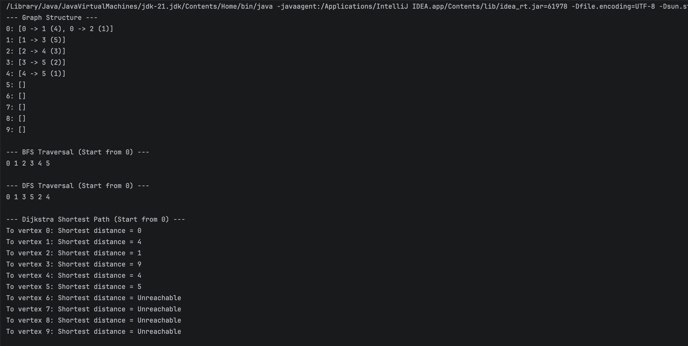
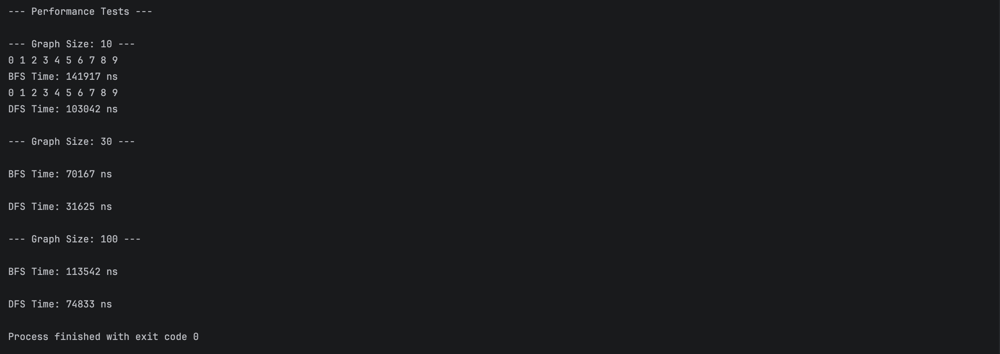

`'I created a new bonus file to make it easy to find the report of my project. But I also wrote a report at the end of the readme, you can find it there too.'
`

# Bonus Task: Dijkstra's Shortest Path Algorithm

This file documents the standalone implementation and execution verification for the assignment bonus points.

---

##  Architectural Changes & Support for Weighted Graphs

To satisfy the bonus requirements, the internal architecture of the graph was successfully upgraded to handle weighted edges while completely maintaining backward compatibility with previous traversal algorithms:
* **`Edge.java` Modification:** Extended the class to include an explicit `private int weight` field alongside getters and an updated constructor.
* **`Graph.java` Structure Update:** Upgraded the internal adjacency list representation from `Map<Integer, List<Vertex>>` to `Map<Integer, List<Edge>>` to store weighted transitions safely.
* **Backward Compatibility:** Adjusted the `bfs` and `dfs` methods to extract IDs dynamically via `edge.getDestination().getId()`. Both algorithms still function perfectly during the performance metrics run.

---

##  Algorithm Implementation

* **Method Signature:** `public void dijkstra(int start)`
* **Approach:** Implemented using **standard loops and arrays/maps** to track minimum distances and visited flags (Time Complexity: $O(V^2)$) without leveraging `PriorityQueue`, strictly conforming to the specific guidelines of the task.

---

##  Execution Verification & Screenshots

Here are the visual confirmations of the correct graph structure, shortest path evaluations, and execution performance metrics from the local terminal environment:

### 1. Graph Mappings & Dijkstra Output Verification
The following screenshot demonstrates the correct building of the weighted graph adjacency list and the verified shortest distance metrics starting from node `0`:

### 2. Backward Compatibility & Performance Traversal Overhead
The screenshot below confirms that the updated code fully supports original lab metrics, completing automated workload tests across scale variations without runtime compilation drops:

