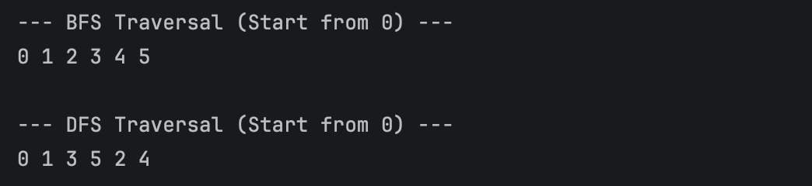
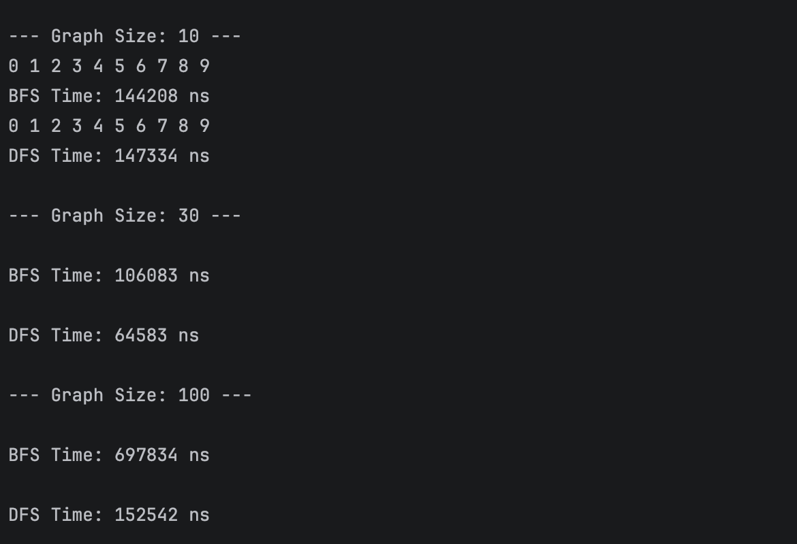
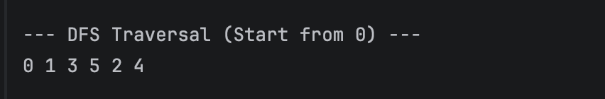
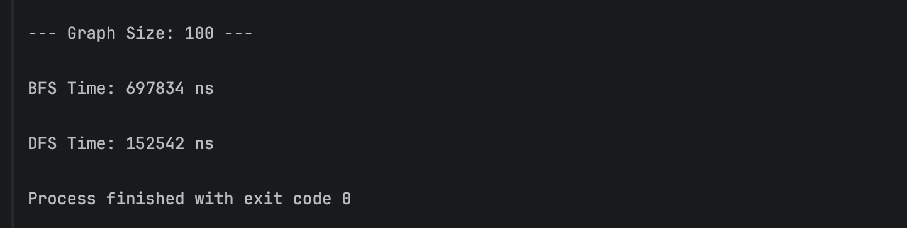

# Assignment 4: Graph Traversal and Representation System

## A. Project Overview 
[]This project implements a graph data structure using an **Adjacency List**.
It includes implementation of two fundamental traversal algorithms:
* []**BFS (Breadth-First Search)**: Explores neighbors level by level.
* []**DFS (Depth-First Search)**: Explores as far as possible along each branch before backtracking.

## []B. Class Descriptions 
* []**Vertex**: Represents a node with a unique ID.
* []**Edge**: Represents a connection between two vertices.
* []**Graph**: Manages vertices and edges using a (Map<Integer, List<Vertex>>) as an adjacency list.
* []**Experiment**: Handles automated testing and execution time measurement.

## []C. Algorithm Descriptions []
### BFS
* **Step-by-step**: Uses a Queue. []Starts at a node, marks it as visited, enqueues it, then visits all its neighbors.
* []**Complexity**: O(V + E).

### DFS
* **Step-by-step**: Uses recursion (stack). []Starts at a node, marks it visited, and recursively visits unvisited neighbors.
* []**Complexity**: O(V + E).

## []D. Experimental Results 
Based on the execution on a MacBook Air:

| Graph Size | BFS Time (ns)           | DFS Time (ns)             |
| :--- |:------------------------|:--------------------------|
| 10 vertices | 144208 ns               | 147334 ns                 |
| 30 vertices | 106083 ns               | 64583 ns                  |
| 100 vertices | 697834 ns         | 152542 ns                          |

[]**Observations**: In my tests, DFS was faster than BFS for a graph of 100 vertices.

## E. Analysis 
* []**BFS vs DFS**: BFS is preferred for finding the shortest path.
* []**Limitations**: DFS can cause a (StackOverflowError) on very deep graphs.
* []**Complexity**: The results match O(V+E) as execution remains efficient for the given sizes.

## []F. Reflection 
[]I learned how to represent graphs using adjacency lists and the practical differences in performance between BFS and DFS. The main challenge was ensuring the graph was correctly initialized before traversal.

## G. Screenshots
Below are the visual confirmations of the program execution, located in the `ssss/` directory:

#### 1. BFS Traversal Output
Displays the level-by-level traversal of the graph (Breadth-First Search).

#### 2. Graph Structure
The adjacency list output, confirming that vertices and edges are stored correctly.

#### 3. DFS Traversal Output
Displays the depth-first traversal of the graph (Depth-First Search).

#### 4. Performance Results
Execution time measurements for graphs of various sizes (10, 30, and 100 vertices).
